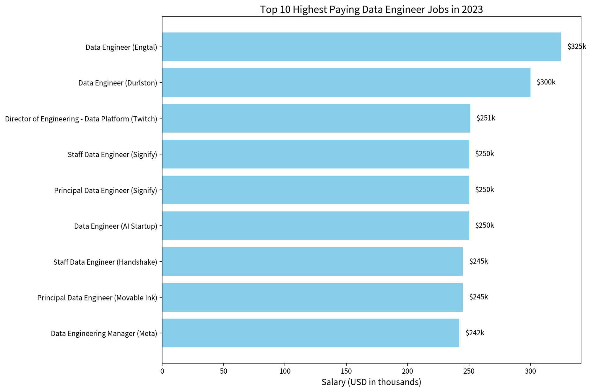
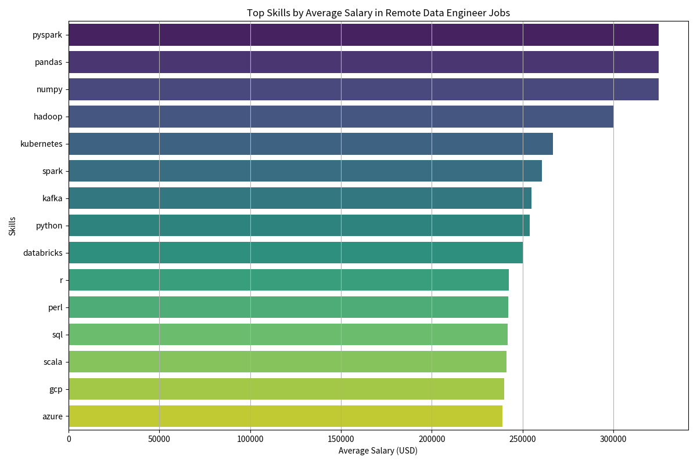

TODO: Update this file later
## Introduction
A dive into the data job market! Focusing on data engineer roles, this project, in-demand skills,  and where high demand meets high salary in data analytics.

SQL queries? Check then out here: [project_sql_course folder](/project_sql_course/) 

## Background
Driven by quest to navigate the data engineer job market more effectively, this project was born from a desire to pinpoint top-paid and in-demand skills, streamlining others work to find optimal jobs.

Data hails from Luke Baraousse Course [SQL Course](https://www.lukebarousse.com/sql). It's packed with insights on job title, salaries, location and essential skills.

### The questions I wanted to answer through my SQL queries were:

1. What are the top-paying data engineer jobs?
2. What skills are required for these top-paying jobs?
3. What skills are most in demand for data engineers?
4. Which skills are associated with higher salaries?
5. What are the most optimal skills to learn as a data engineer?

## Tools I Used
For the deep dive into the data engineer job market, I harnessed the power of several key tools:

- **SQL:** The backbone of my analysis, allowing me to query the database and unearth critical insights.
- **PostgreSQL:** The chosen database managament system, ideal for handling the job posting data.
- **Visual Studio Code:** My go-to for database management and executing SQL queries.
- **Git & GitHub:** Essential for version control and sharing my SQL scripts and analysis, ensuering collaboration and project tracking.

## The Analysis
Each query for this project aime at investagating specific aspects of the data analys job market.
Here's how I approached each question:

### 1. Top Paying Data Engineer Jobs
To identify the highest-paying roles I filtered data engineer positions by average yearly salary and location, focusing on remote jobs. This query highlights the high paying opportunities in the field.

```sql
SELECT
    job_id,
    job_title,
    job_location,
    job_schedule_type,
    salary_year_avg,
    job_posted_date::date,
    name
FROM
    job_postings_fact as jobs
LEFT JOIN company_dim as companies ON
    jobs.company_id = companies.company_id
WHERE
    job_title_short = 'Data Engineer' AND
    salary_year_avg IS NOT NULL AND
    job_location = 'Anywhere'
ORDER BY
    salary_year_avg DESC
LIMIT 10;
```
Here's the breakdown of the top data engineer jobs in 2023:
- **Wide Salary Range:** Top 10 paying data engineer roles span from $242,000 to $325,000, indicating significant salary potential in the field.
- **Diverse Employers:** Companies like Durlston Partners, Twicht, and Engtal are among those offering high salaries, showing a broad interest across different industries.
- **Job Title Veriety:** There's a high diversity in job titles, from Data Engineer to Director of Engineering - Data Plarform, reflecting veries roles and specializations within data analytics.

*Bar graph visualizing the top 10 salaries for data engineers; Grok generated this graph from my SQL query results*

### 2. Skills for Top Paying Jobs
To understand what skills are required for the top-paying jobs, I joined the job postings with the skills data, providing insights into what employers value for high-compensation roles.

```sql
WITH top_paying AS (SELECT
    job_id,
    job_title,
    job_location,
    salary_year_avg,
    name AS company_name
FROM
    job_postings_fact as jobs
LEFT JOIN company_dim as companies ON
    jobs.company_id = companies.company_id
WHERE
    job_title_short = 'Data Engineer' AND
    salary_year_avg IS NOT NULL AND
    job_location = 'Anywhere'
)
SELECT
    s.skills,
    tp.*
FROM top_paying AS tp
INNER JOIN skills_job_dim AS js ON tp.job_id = js.job_id
INNER JOIN skills_dim AS s ON js.skill_id = s.skill_id
ORDER BY
    tp.salary_year_avg DESC;
```
Here's the breakdown of the most demanded skills for the top 10 highest paying data analyst jobs in 2023:

- **Big Data Ecosystem Dominates Top Pay** The highest salaries ($300k–$325k) are heavily concentrated around mature Big Data technologies.
PySpark, Spark, Hadoop, and Kafka consistently appear in the top-paying roles. Companies are willing to pay a significant premium for engineers who can handle large-scale data processing and real-time pipelines.
- **Python + Modern Data Stack is the Foundation for High Salaries** Python is the clear #1 skill and serves as the base for nearly all $250k+ opportunities. When combined with Pandas, NumPy, PySpark, Kubernetes, and cloud tools (AWS/GCP/Azure), it unlocks the highest compensation tiers.
- **Specialization Pays, but Core Skills Rule** While niche skills like Rust, Databricks, or ML frameworks (TensorFlow/PyTorch) appear in high-salary roles, the biggest trend is that core foundational skills (Python, Spark, SQL, Kafka, Kubernetes) deliver the most consistent high compensation across multiple companies and job levels.


*Bar graph for the top paying skills for data engineers; Grok generated this graph from my SQL query results*

### 3. In-Demand Skills for Data Engineer
This query helped indentify the skills most frequently requested in job postings, directing focus to areas with high demand.

```sql
WITH number_jobs_skills AS (
    SELECT
        COUNT(jp.*) AS skill_count,
        sj.skill_id,
        ROUND(AVG(jp.salary_year_avg))  AS salary_skill
    FROM  
        skills_job_dim AS sj  
    INNER JOIN job_postings_fact AS jp ON sj.job_id = jp.job_id     
    WHERE
       jp.job_location = 'Anywhere' AND
        jp.job_title_short = 'Data Engineer'
       AND jp.salary_year_avg IS NOT NULL
    GROUP BY
        sj.skill_id
)

    SELECT 
    s.skill_id,
    s.skills,
    skill_count,
    salary_skill
FROM 
    number_jobs_skills AS n
INNER JOIN skills_dim AS s ON n.skill_id = s.skill_id
ORDER BY
    skill_count DESC;
```
Here's the breakdown of the most demanded skills for data engineers in 2023

- **Core Foundations Dominate:** SQL and Python are overwhelmingly the most requested skills (14k+ each). They remain non-negotiable baseline requirements for almost every Data Engineer role.

- **Cloud Platforms are Essential:** AWS leads strongly (8.5k), followed by Azure (7k) and GCP (3k). Cloud experience is now table stakes.

- **Modern Data Stack is Rising Fast:** Snowflake, Databricks, Airflow, and Kafka all rank very high. This shows strong demand for cloud data warehouses, orchestration tools, and real-time streaming pipelines.

**Overall Trend:** In 2023, the ideal Data Engineer profile combined strong programming foundations (SQL + Python) with cloud platforms and modern pipeline tools (Airflow, Kafka, Snowflake, Databricks). There is a clear move toward engineers who can build scalable, orchestrated, cloud-native data platforms rather than just traditional ETL.


| Skills       | Demand Count |
|--------------|--------------|
| sql          | 14,213       |
| python       | 13,893       |
| aws          | 8,570        |
| azure        | 6,997        |
| spark        | 6,612        |
| airflow      | 4,329        |
| snowflake    | 4,053        |
| java         | 3,801        |
| databricks   | 3,716        |
| kafka        | 3,391        |
| scala        | 3,346        |
| gcp          | 3,049        |
| redshift     | 2,924        |
| hadoop       | 2,791        |
| pyspark      | 2,459        |
| nosql        | 2,402        |
| tableau      | 2,321        |
| git          | 2,310        |
| docker       | 2,246        |
| kubernetes   | 2,076        |
| power bi     | 2,042        |
| sql server   | 2,014        |
| oracle       | 1,764        |
| bigquery     | 1,603        |
| terraform    | 1,510        | 
*Table of the demand for the top 5 skills in data engineer job postings*

### 4. Skills Based on Salary
Exploring the average salaries associated with different skills revealed which skills are the highest paying.
```sql
WITH skills_name AS (
    SELECT
        skill.skills,
        jobs.job_id
    FROM skills_job_dim AS jobs
    INNER JOIN skills_dim AS skill ON jobs.skill_id = skill.skill_id
)
SELECT
    s.skills,
    ROUND(AVG(jp.salary_year_avg)) AS avg_salary
FROM skills_name AS s 
INNER JOIN job_postings_fact AS jp ON s.job_id = jp.job_id
WHERE
    jp.job_title_short = 'Data Engineer' AND
    jp.job_location = 'Anywhere' AND
    jp.salary_year_avg IS NOT NULL
GROUP BY
    s.skills
ORDER BY
    avg_salary DESC
```

| Skills       | Average Salary ($) |
|--------------|--------------------|
| assembly     | $192,500           |
| mongo        | $182,223           |
| ggplot2      | $176,250           |
| rust         | $172,819           |
| clojure      | $170,867           |
| perl         | $169,000           |
| neo4j        | $166,559           |
| solidity     | $166,250           |
| graphql      | $162,547           |
| julia        | $160,500           |
| splunk       | $160,397           |
| bitbucket    | $160,333           |
| zoom         | $159,000           |
| kubernetes   | $158,190           |
| numpy        | $157,592           |
| fastapi      | $157,500           |
| mxnet        | $157,500           |
| redis        | $157,000           |
| trello       | $155,000           |
| jquery       | $151,667           |
| express      | $151,636           |
| cassandra    | $151,282           |
| unify        | $151,000           |
| kafka        | $150,549           |
| vmware       | $150,000           |
*Table of the average salary for the top 10 paying skills for data engineers*

Here's a breakdown of the results for top paying skills for Data Engineers:
- **Niche & Specialized Languages Pay the Highest:** Skills like Assembly, Rust, Clojure, Perl, Julia, and Solidity top the salary list. These are rarer skills, and professionals who know them are heavily rewarded.

- **Modern / Emerging Tools Command Premiums:** 
    - GraphQL, FastAPI, and Neo4j show strong pay for newer technologies in APIs and graph databases.

    - ML-adjacent tools (Numpy, MXNet, Keras, TensorFlow, PyTorch) also appear in the high-paying tier.

- **DevOps & Infrastructure Skills Pay Well:** Kubernetes, Terraform, Ansible, Docker, and VMWare are among the better-paying skills, reflecting the “DataOps” and cloud infrastructure demand.

- **Big Data & Distributed Systems Still Strong:** Kafka and Cassandra remain high-paying, consistent with the need for scalable data pipelines.

**Overall Trend:** The highest salaries went to specialized, low-volume skills rather than the most common ones. While SQL, Python, AWS, and Spark are the most demanded (and still pay well), the real salary premiums came from rare languages, niche databases, and cutting-edge tools. Companies were willing to pay significantly more for engineers who bring unique or hard-to-find expertise.

### 5. Most Optimal Skills to Learn
Combining insights from demand and salary data, this query aimed to pinpoint skills that are both in high demand and have high salaries, offering a strategic focus for skills development.

```sql
WITH skills_name AS (
    SELECT
        skill.skills,
        jobs.job_id,
        skill.skill_id
    FROM skills_job_dim AS jobs
    INNER JOIN skills_dim AS skill ON jobs.skill_id = skill.skill_id
)
SELECT
    s.skills,
    COUNT(s.skill_id) AS demanded_skills,
    ROUND(AVG(jp.salary_year_avg)) AS avg_salary
FROM skills_name AS s 
INNER JOIN job_postings_fact AS jp ON s.job_id = jp.job_id
WHERE
    jp.job_title_short = 'Data Engineer' AND
    jp.job_location = 'Anywhere' AND
    jp.salary_year_avg IS NOT NULL
GROUP BY
    s.skills
HAVING
    COUNT(s.skill_id) > 10
ORDER BY
    avg_salary DESC,
    demanded_skills DESC
LIMIT 25;
```
| Skills        | Demand Count | Avg Salary ($) |
|---------------|--------------|----------------|
| kubernetes    | 56           | $158,190       |
| numpy         | 14           | $157,592       |
| cassandra     | 19           | $151,282       |
| kafka         | 134          | $150,549       |
| golang        | 11           | $147,818       |
| terraform     | 44           | $146,057       |
| pandas        | 38           | $144,656       |
| elasticsearch | 21           | $144,102       |
| ruby          | 28           | $144,000       |
| aurora        | 14           | $142,887       |
| pytorch       | 11           | $142,254       |
| scala         | 113          | $141,777       |
| spark         | 237          | $139,838       |
| pyspark       | 64           | $139,428       |
| dynamodb      | 27           | $138,883       |
| mongodb       | 64           | $138,569       |
| airflow       | 151          | $138,518       |
| java          | 139          | $138,087       |
| hadoop        | 98           | $137,707       |
| typescript    | 19           | $137,207       |
| nosql         | 93           | $136,430       |
| shell         | 34           | $135,499       |
| looker        | 30           | $134,614       |
| snowflake     | 202          | $134,373       |
| bash          | 25           | $134,315       |
*Table of the most optimal skills for data engineers sorted by salary*

Here's a breakdown of the most optimal skills for Data Analyst in 2023:
- **Highest Paying Skills are often specialized and lower-volume:** Kubernetes ($158k), Numpy ($157k), Cassandra, and Kafka ($150k+) lead the list. These command premium pay due to their complexity and scarcity of strong expertise.

- **Best Balance of Demand + Salary:** Spark (237 demand, $139.8k)
Snowflake (202 demand, $134.4k)
Airflow (151 demand, $138.5k)
Kafka (134 demand, $150.5k)
Java (139 demand, $138k)

These are the most valuable "must-have" skills for high-paying roles.
- **Trending Categories:** 
    - **Cloud & Infrastructure-as-Code:** Kubernetes, Terraform, Aurora, DynamoDB — strong premium.

    - **Data Orchestration & Streaming:** Airflow + Kafka are very hot.

    - **Modern Data Stack:** Snowflake and Looker show the shift toward cloud data warehouses and BI tools.

    - **Big Data Ecosystem:** Spark, PySpark, Hadoop, Cassandra, Elasticsearch still pay very well.

    - **Programming Languages:** Scala, Golang, and Java offer high salaries, while Python ecosystem tools (Pandas, Numpy, PyTorch) also perform strongly.

**Overall Trend:** Data Engineers were rewarded most for distributed systems, cloud infrastructure, and data pipeline orchestration skills. Pure volume skills (like basic SQL/Python) pay less than specialized modern tools.

## What I Learned
This project was my first hands-on Data Analysis project, where I used SQL as the primary tool to explore and derive insights from real-world job market data. What started as a goal to strengthen my SQL skills quickly evolved into a much broader learning experience. Here’s what I gained:

- **SQL Mastery:** I moved from only having basic theoretical knowledge to confidently writing complex queries. I now have practical experience with JOINs, CTEs, subqueries, and data aggregation, allowing me to efficiently extract, transform, and analyze data to answer meaningful business questions.
- **PostgreSQL Proficiency:** I learned how to install, set up, and manage a local PostgreSQL database. Working directly in VS Code, I gained comfort with database management, query execution, and performance considerations.
- **Development & Collaboration Tools:** I incorporated VS Code, Git, and GitHub into my workflow. This helped me understand version control, project organization, and how to properly document and showcase technical work publicly by turning a simple analysis into a professional portfolio piece.
- **Analytical Thinking:** Beyond technical skills, I significantly improved my ability to break down complex, real-world problems into specific, answerable questions. I learned how to systematically approach data exploration and transform raw data into clear, actionable insights using SQL.

## Conclusions

### Insights
From the analysis, several general insights emerged:

1. **Top-Paying Data Engineer Jobs:**The highest-paying remote roles in the dataset reached up to $325,000 per year. These premium positions were primarily held by companies such as Engtal and Durlston Partners, targeting experienced Data Engineers with strong big data expertise.
2. **Skills for Top-Paying Jobs:**The best-compensated roles heavily emphasized expertise in large-scale data processing. Skills like PySpark, Spark, Hadoop, Kafka, and Kubernetes were consistently present in positions offering $250,000 and above. Leadership and architecture-focused titles (e.g., Director of Engineering, Principal/Staff Data Engineer) also commanded significant premiums.
3. **Most In-Demand Skills:** Python stood out as the most requested skill by a wide margin, appearing across the majority of high-paying roles. Other highly demanded technologies included SQL, Spark, and Kafka, highlighting the importance of both programming fundamentals and modern data pipeline tools.
4. **Skills with Higher Salaries:**There is a clear salary premium for big data and distributed systems skills. PySpark, Pandas, NumPy, Hadoop, and Kubernetes were associated with the highest average salaries. Cloud technologies (AWS, GCP, Azure) and orchestration tools (Docker, Terraform) also showed strong positive correlation with compensation.
5. **Optimal Skills for Job Market Value:**The most valuable skill combination for maximizing earning potential is Python + Spark/PySpark + Kafka + Kubernetes. Engineers who master this core stack, supplemented with cloud platforms and data orchestration tools, position themselves strongly for roles in the $250,000 – $325,000 range.


### Closing Thoughts 
This analysis reinforced that the remote Data Engineer market remains highly competitive and rewarding for those with the right technical combination. While foundational skills like Python and SQL are essential, specialization in big data technologies and modern infrastructure tools is what truly drives top-tier compensation.